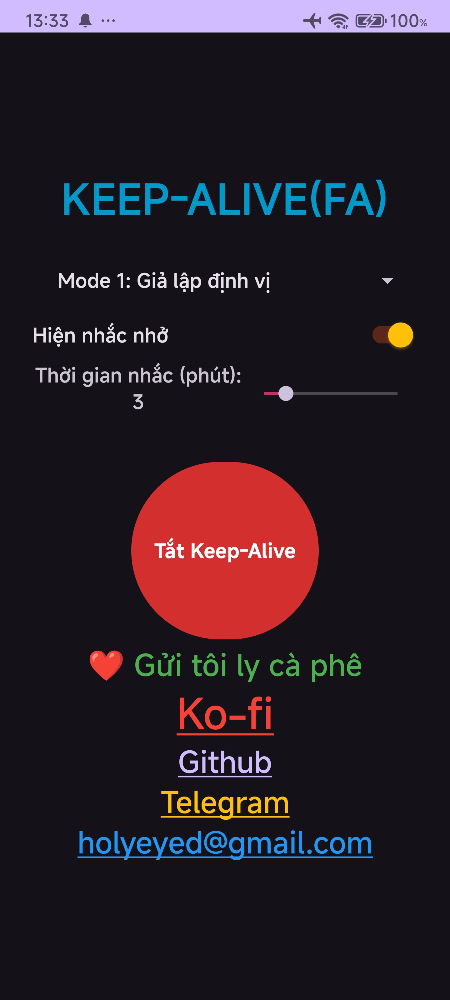

Chương trình dùng fix lỗi thông báo trên xiaomi hyperOS
* 05/10/2026
- Do những thay đổi trong whitelist sẽ bị hệ thống viết đè sau 1 thời gian, tôi chuyển sang dùng phần mềm đánh thức nhỏ gọn ko ảnh hưởng đến trải nghiệm người dùng
- phần mềm được chạy tự động, bạn chỉ cần cấp quyền thông báo và định vị cho nó
- Với các ứng dụng cần thông báo, bạn phải cài Autostart cho nó, để nó có thể khởi động lại sau đó.
  + Chọn chế độ đánh thức, ưu tiên chọn Google gms để dễ dàng nhất
  + Chọn có hiện thông báo nhắc nhở cho mỗi lần đánh thức
  + Chọn quãng thời gian đánh thức máy (<10 phút)
  + Sau cùng bạn nhấn "Chạy Keep-Alive" là được
  + Ứng dụng tự chạy lại khi khởi động lại máy, bạn ko cần mở lại ứng dụng.

* phiên bản cũ (dùng adb trên máy tính)
Hoàn toàn tự động một khi bạn mở chức năng nhà phát triển, gỡ lỗi usb và kết nối thành công điện thoại với máy tính.
Các bước thực hiện:
- Cài đặt chương trình adb tool trên máy tính
- Mở chế độ nhà phát triển trên điện thoại
- bật chức năng gỡ lỗi usb trên điện thoại
- kết nối điện thoại với máy tính
- nhấp đúp vào file fast-tweak.cmd để chạy lệnh
Tận hưởng kết quả đạt được!

